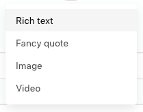
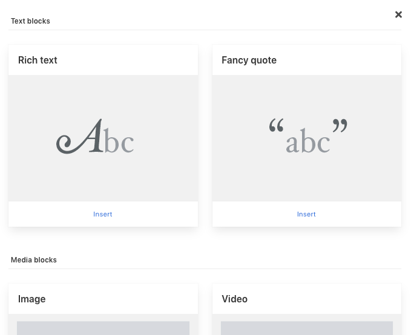

# Otter 


- Create rich content editors by composing content blocks from built-in fields 🐟
- Simple, declarative syntax 💦
- Easily integrates as a React component 🌿
- Generates post data in a simple JSON format 🏞


### Contents

- [Otter element](#otter-element)
- [Block API](#block-api)
- [Field API](#field-api)
- [Sample setup with create-react-app](#sample-setup-with-create-react-app)
- [Basic full example](#basic-full-example)
- [CSS](#css)
- [Demo project](#demo-project)
- [Development](#development)


## Otter element

```jsx
<Otter.Editor
  blocks={blocks}
  data={data}
  load_state={Otter.State.Loaded}
  save={Otter.Save.OnInput}
  delegate={my_delegate} />
```

Renders an Otter editor.

- `blocks` : array of editor blocks available in this editor (see [Block API](#block-api))
- `data` : initialize the editor with some content
- `load_state` : one of the loading states (`Loading` and `Error` are useful when loading content data asynchronously):
    - `Otter.State.Loading`
    - `Otter.State.Loaded`
    - `Otter.State.Error`
- `save` : specify when `save()` is called on the delegate:
    - `Otter.Save.OnInput` : call `save()` whenever the user makes a change
    - `Otter.Save.WhenSaveButtonClicked` : render a save button, and call `save()` only when this is clicked
- `delegate` :
    - `save()` : Otter calls this method of your delegate object when data is saved in the editor.
    - `block_toggled()` : called when the user expands/closes a sub-block (e.g. if your otter editor is within an iframe, you might then update the iframe height.)

```js
const my_delegate = {
  save(data) {
    // Kick-off a request to update the post data
  },
  block_toggled() {
    // set iframe height
  },
};
```


## Block API

`Otter.Blockset([ <block>, <block>, ... ]) -> blockset`

- Define a Blockset: a set of content block definitions: the definitions used by Otter to initialize and render the block-based editor.
- Returns a Blockset object.
- Arguments:
    - `[ <block>, <block>, ... ]`: an array of content block definitions

```js
const text_blocks = Otter.Blockset([
  {
    type: 'MyTextBlock',
    description: 'Text block',
    thumbnail: '/path/to/block-thumbnail.png',
    fields: [
      <field>, ...
    ],
    hidden: true,
  },
]);
```

- `thumbnail` is optional and only used by Otter when initialized with *grouped content blocks*.
- `hidden` is optional, default `false`. Set this to true if this block is to be used in a Repeater or SubBlock, so shouldn't be picked by the user as a top level block.


### Grouped content blocks

`Otter.Blockset()` can be passed a flat array of block definitions, or you can group them together like so.

```js
const blocks = Otter.Blockset({
  text: {
    name: 'Text blocks',
    blocks: [ <block>, <block>, ... ],
  },
  media: {
    name: 'Media blocks',
    blocks: [ <block>, <block>, ... ],
  },
});
```

When passed a flat array Blockset, the Otter block picker is a simple dropdown. When passed a Blockset of grouped blocks, the block picker is a large popup, organised by group, and including block thumbnails.


*Block picker for flat blockset:*




*Block picker for grouped blockset:*




### Blockset methods

`get(block_type) -> block`

- Returns the requested block object from the Blockset.

```js
const text = text_blocks.get('MyTextBlock');
```


## Field API

A **block** contains one or more **fields** (see above).

- `<field>` :

```js
{
  name: 'content',
  description: 'Content',
  type: Otter.Fields.TextArea,
  display_if: {
    sibling: <sibling_name>,
    [not_]equal_to: <value>,
  },
}
```

### display_if

When using `display_if`, the editor field is displayed/hidden based on the value of one or more siblings. (The siblings must be `Bool` or `Radio` fields.)

`display_if` can take a single rule object, or an array of objects referring to multiple siblings.


### Field types:

`Otter.Fields.TextInput`

- A simple text input.

`Otter.Fields.TextArea`

- A textarea for multiline, unstyled text.

`Otter.Fields.TextEditor`

- Multiline rich text editor.

`Otter.Fields.Bool`

- A true/false toggle.
- Options:
    - `text__yes: <string>` : label for true option (default `"Yes"`)
    - `text__no:  <string>` : label for false option (default `"No"`)

`Otter.Fields.Radios`

- A set of radio buttons
- Options:
    - `options: { value: "Label", ... }` : the set of radios

`Otter.Fields.Select`

- A select dropdown
- Options:
    - `options: { value: "Label", ... }` : the select values

`Otter.Fields.WPMedia`

- Wordpress-specific: let the user pick an item from a wordpress media browser.
- Options:
    - `media_types: [ <type>, <type, ... ]` : control which file types appear in the media browser. Values: `jpg`, `png`, `gif`, `mov`, `mp4`, `svg`, `pdf`, `csv`. If `media_types` option is omitted or an empty array, the items are not constrained by type.

`Otter.Fields.SubBlock`

- Embed another block into this block. Otter can compose blocks together recursively, allowing for complex content types, and aiding re-use of block definitions.
- Options:
    - `description: <string>` : if supplied, used to title the wrapped subblock in the editor
    - `subblock_type: MyTextBlock` : the block object to be embedded as a subblock
    - `optional: <bool>` : add a toggle to enable or disable the subblock

```js
Otter.Blockset([
  {
    name: 'MyHeaderAndContentBlock',
    fields: [
      {
        name: 'header',
        description: 'Header',
        type: Otter.Fields.TextInput,
      },
      {
        name: 'content',
        description: 'Content',
        type: Otter.Fields.SubBlock,
        subblock_type: text_blocks.get('MyTextBlock'),
      },
    ],
  }
]);
```

`Otter.Fields.SubBlockArray`

- A repeater of subblocks, where the user picks blocks from one or more predefined types.
- Options:
    - `description` : if supplied, used to title the wrapped subblock array in the editor
    - `subblock_types: [ <block1>, <block2>, ... ]` : an array of block objects defining which types of block the user will be able to pick from
    - `max: <number>` : optionally limit the number of subblocks the user can add

```js
Otter.Blockset([
  {
    name: 'MyMultiContentBlock',
    fields: [
      {
        name: 'content',
        type: Otter.Fields.SubBlockArray,
        subblock_types: [
          my_blocks.get('MyContentBlock__1'),
          my_blocks.get('MyContentBlock__2'),
        ],
      },
    ],
  }
]);
```


## Sample setup with create-react-app

```sh
npx create-react-app my-app
cd my-app
npm i -P otter-editor
```

To start:

- replace src/App.js with the [demo App.js file](src/App.js)
- run `npm run start`
- visit `localhost:3000`


## Basic full example

```js
import React from 'react';
import ReactDOM from 'react-dom';
import Otter from 'otter-editor';
import 'otter-editor/dist/otter.css';


// Define content blocks
// -------------------------------

const blockset = Otter.Blockset([
  {
    type: 'HeaderBlock',
    description: 'Heading',
    fields: [
      { name: 'title', description: 'Title', type: Otter.Fields.TextInput },
      { name: 'author', description: 'Author', type: Otter.Fields.TextInput },
    ],
  },
  {
    type: 'TextBlock',
    description: 'Text content',
    fields: [
      { name: 'content', description: 'Content', type: Otter.Fields.TextArea },
    ],
  },
]);


// Handle updates
// -------------------------------

const delegate = {
  on_update(data) {
    console.log('new data:', data),
  },
};


// Fetch some data & render
// -------------------------------

function render() {
  const data = [
    { __type: 'HeaderBlock', title: 'My article', author: 'Jane Smith' },
  ];

  ReactDOM.render(
    <Otter.Editor data={data} load_state='loaded' delegate={delegate} blocks={blockset} />,
    document.querySelector('.otter-container')
  );
}


render();
```


## CSS

The app needs to import the Otter CSS:

```js
import 'otter-editor/dist/otter.css';
```

This currently includes bulma so at present weighs ~150kB. **TBD:** move to something more lightweight.


## Demo project

/demo contains a sample Otter editor, including some simple predefined blocks. Run `npm run dev` to start webpack-dev-server, then visit `http://localhost:3000`.

Or using [parcel](https://parceljs.org) (npm i -g parcel-bundler), instead run `parcel demo/index.html`.


## Development

Use the demo project and the `dev` task.

To publish: `npm publish`.


### License

Otter is dual-licensed to enable Wordpress integration. The license is:

- GPLv2 for the purpose of embedding within Wordpress themes
- MIT for all other purposes

See [LICENSE.md](LICENSE.md) for details.

